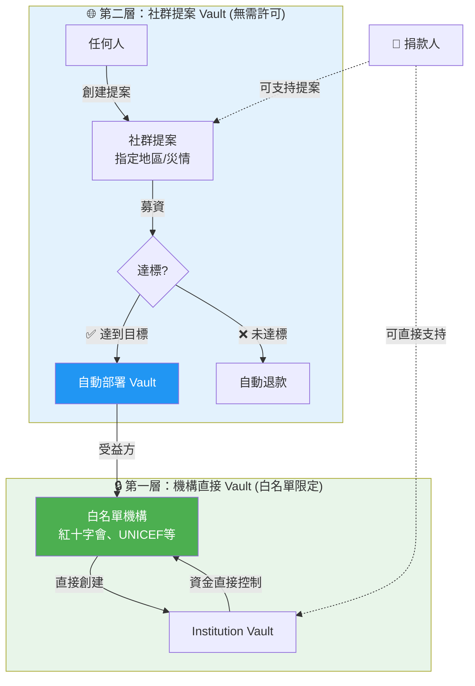
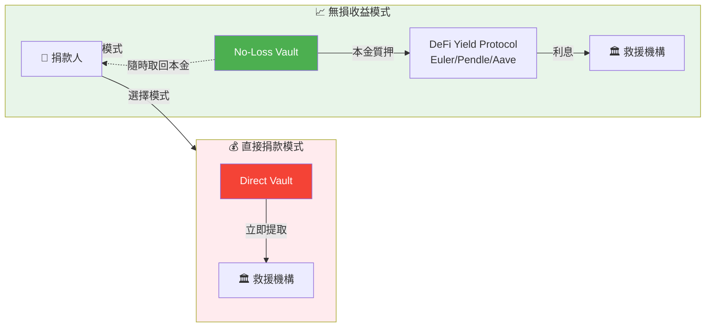
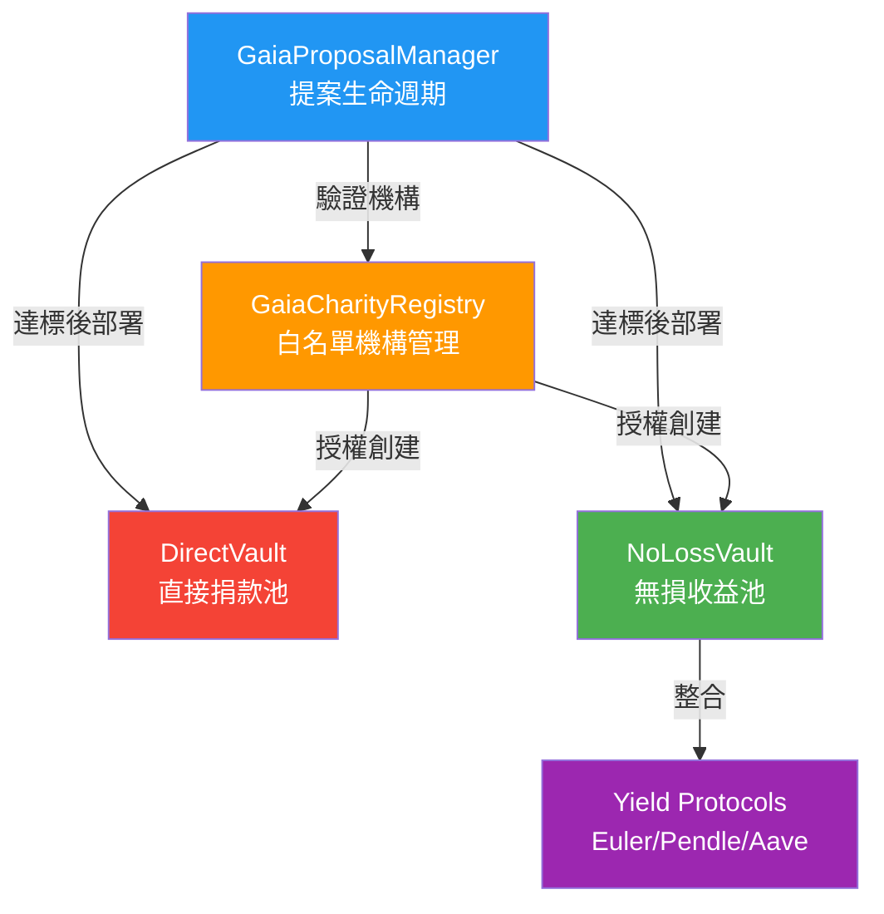
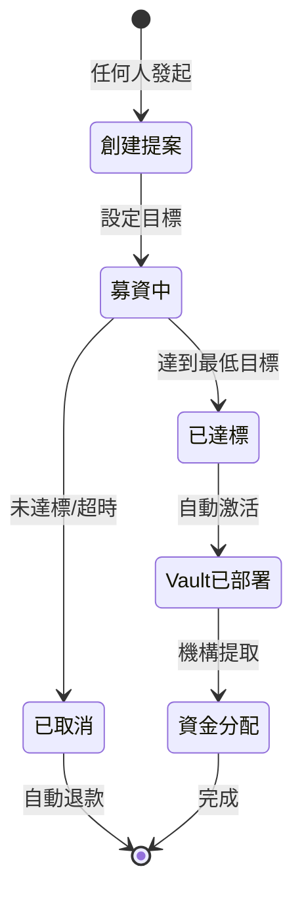

# GaiaLink

**基於 3D 地球的人道救援協作網絡** - 讓救援需求可視化、可驗證、可追蹤，並以無需許可的方式進行捐贈

---

## 問題與挑戰

目前，在捐款或救災平台中，存在以下痛點：

- **資訊扁平化**：大多數網站僅以列表形式呈現災情，使用者難以直覺判斷哪些地區最需要資源
- **驗證成本高**：使用者需要花費大量時間驗證機構背景、項目真實性
- **信任門檻**：缺乏透明的資金流向追蹤，捐款後難以確認款項用途
- **參與限制**：只有特定機構可以發起募資，民眾無法為未被覆蓋的災情主動籌款

---

## 解決方案

Gaia Link 透過以下四大核心特性，重新定義人道救援的協作方式：

### 🌍 3D 地球可視化

將全球災情與救援需求投射在互動式 3D 地球上，透過**視覺化的點點**直觀呈現：

- **位置**：精確標示災情發生地
- **緊急程度**：點的大小和脈動頻率反映資源缺口
- **狀態**：透過顏色區分不同階段

#### 視覺化顏色系統

| 顏色 | 含義 | 說明 |
|------|------|------|
| 🟡 **黃色** | 已部署 Vault (機構或社群提案已達標) | 資金池已啟動，可直接捐款 |
| 🔴 **紅色** | 提案進行中 (尚未達標) | 正在募資，達標後將開啟 Vault |
| 🟣 **紫色** | 新聞/待驗證事件 | 來自 `backend_data` 的危機報導，可發起新提案 |
| 🔵 **藍色** | 機構節點/其他 | 白名單機構或輔助資訊點 |

使用者只需旋轉地球，即可清晰看到哪些地方點點特別密集（缺乏資源），哪些地方已獲得充分支援。

### 🤖 自然語言意圖介面

整合 **SpoonOS AI Agent**，讓捐款和查詢變得像對話一樣簡單：

- **意圖識別**：「我想幫助土耳其地震災民」→ Agent 自動定位到相關提案
- **驗證查詢**：「這個危機是真的嗎？」→ Agent 透過 MCP 搜尋 Polymarket、新聞等多源資料進行驗證
- **智能建議**：「我該捐多少？」→ Agent 分析 Gas 費用、資金缺口，提供最佳捐款策略
- **操作執行**：「列出所有活躍的 Vault」→ Agent 調用鏈上合約，生成報告並可直接跳轉

**4 大 AI 技能模組**（詳見下方 [Agent Skills](#agent-skills) 章節）：
- 🔍 捐款追蹤 (Donation Tracker)
- 🏦 池子管理 (Pool Manager)  
- 🚨 危機響應 (Crisis Response)
- 💡 捐款顧問 (Donation Advisor)

### ✅ 可驗證 & 可追蹤

- **鏈上提案**：所有募資提案和 Vault 狀態都記錄在區塊鏈，公開透明
- **交易追蹤**：每筆捐款都有唯一的交易哈希，可在區塊鏈瀏覽器查詢
- **危機驗證**：Agent 自動整合 Polymarket 預測市場、新聞 API 等外部數據源，為危機提供可信度評分（0-100）
- **白名單機構**：資金最終只能流向經過驗證的白名單機構地址，確保款項用於正當用途

### 🔓 無需許可的捐贈

採用**兩層架構**，平衡去中心化和資金安全：



#### 第一層：機構直接 Vault（白名單限定）
- **誰能開啟**：僅限已註冊的白名單機構（如紅十字會、聯合國兒童基金會等）
- **資金流向**：直接流入機構控制的地址
- **適用場景**：大型、長期的救援項目

#### 第二層：社群提案 Vault（無需許可）
- **誰能開啟**：任何人都可以發起提案，針對特定地區、災情創建募資計劃
- **達標機制**：
  - 提案需要達到預設的最低募資目標（如 1000 USDC）
  - 達標後，系統自動部署 Vault 並將資金轉入
  - 未達標則自動退款給所有貢獻者
- **資金流向**：提案創建者必須指定白名單機構作為受益方，資金最終仍流向可信地址
- **適用場景**：緊急、小型、或被主流機構忽視的救援需求

> **類比**：第二層就像 Layer 2，提供無需許可的靈活性，但底層仍受第一層（白名單機構）的安全保障。

---

## 核心功能

### 雙模式捐款機制



| 模式 | 說明 | DeFi 協議 |
|------|------|-----------|
| **直接捐款** | 資金即時進入 Vault，機構可隨時提取 | - |
| **無損收益捐款** | 本金存入 Yield 協議，僅將利息捐贈，本金可隨時取回 | Euler, Pendle, Aave |

使用者可選擇一次性捐款（直接模式），或長期支持（無損模式），兩種方式都可透過 Agent 或手動操作執行。

### 新聞事件接入

系統可整合新聞 API、NASA EONET（自然災害監測）、GDELT（全球事件資料庫）等數據源，自動在地球上標註新發生的危機（紫色點點）。使用者看到這些點後，可選擇：
- 使用 Agent 查詢事件詳情和可信度
- 發起新的社群提案
- 等待機構響應

---

## 智能合約架構



**社群提案生命週期**：



| 合約 | 功能 |
|------|------|
| `GaiaCharityRegistry` | 白名單機構註冊與管理 |
| `GaiaProposalManager` | 社群提案生命週期管理（創建、募資、達標、激活）|
| `DirectVault` | 直接捐款資金池 |
| `NoLossVault` | 無損收益捐款資金池（整合 Yield 協議）|

---

## 技術棧

| 層級 | 技術 |
|------|------|
| **Frontend** | Next.js 16, React 19, MapLibre GL, Wagmi, RainbowKit |
| **Smart Contracts** | Solidity, Foundry, OpenZeppelin |
| **AI Agent** | Python 3.11+, FastMCP, HuggingFace, SpoonOS |
| **Network** | Ethereum Sepolia (USDC) |
| **Data Sources** | Polymarket API, NASA EONET, GDELT, News APIs |

---

## 快速開始

### 前置需求

請確保您的系統已安裝以下工具：

- **Programming Languages**:
  - [Python 3.11+](https://www.python.org/) (Agent 運行環境)
  - [Node.js 20+](https://nodejs.org/) (推薦使用 [Bun](https://bun.sh/) 作為包管理器)
- **Tools**:
  - [Foundry](https://getfoundry.sh/) (以太坊開發框架)
  - [uv](https://github.com/astral-sh/uv) (Python 快速包管理器)

---

### 1. 區塊鏈設置 (Blockchain Setup)

啟動本地測試鏈並部署合約：

```bash
# 1. 啟動 Anvil 本地鏈 (保持此終端運行)
anvil --port 8545

# 2. 部署合約 (開啟新終端)
cd contracts
forge script script/SetupDemo.s.sol --rpc-url http://localhost:8545 --broadcast --private-key 0xac0974bec39a17e36ba4a6b4d238ff944bacb478cbed5efcae784d7bf4f2ff80
```

> 部署腳本會自動生成 25 個真實案例提案。

# 3. 同步合約地址 (Sync Contracts)

部署完成後，執行同步腳本將新地址寫入前端配置：

```bash
# 在根目錄執行
node sync-contracts.js
```

> 此腳本會更新 `frontend/src/lib/contracts.ts` 以及 `python_agent/.env`。
> **注意**：這會自動將最新部署的合約地址寫入這些配置檔案，無需手動修改。

---

### 2. Agent 設置 (Agent Setup)

使用 `uv` 初始化 Python 環境並啟動 MCP 服務：

```bash
cd python_agent

# 1. 安裝依賴 (使用 uv)
uv sync

# 2. 激活虛擬環境
source .venv/bin/activate

# 3. 設置環境變數
cp .env.example .env
# 請確保 .env 中的合約地址與部署輸出一致 (通常不需要修改，使用確定性地址)

# 4. 啟動 MCP Server (SSE 模式)
# 這將啟動 Agent 並監聽 HTTP 請求，供前端調用
uv run python -m gaia_link.mcp_server --sse
uv run uvicorn server:app --reload --port 8000
```

---

### 3. 前端設置 (Frontend Setup)

啟動 Next.js 前端應用：

```bash
cd frontend

# 1. 安裝依賴
bun install

# 2. 啟動開發伺服器
bun run dev
```

開啟瀏覽器訪問 [http://localhost:3000](http://localhost:3000)，您應該能看到 3D 地球和已部署的災害提案。

### 環境變數配置

前端 `frontend/.env.local` 範例：

```bash
NEXT_PUBLIC_WALLETCONNECT_PROJECT_ID=your_id
NEXT_PUBLIC_API_URL=http://localhost:8000  # Agent API
```

---

## SpoonOS Agent

GaiaLink 整合 SpoonOS AI Agent，提供智能化的捐款協助和危機驗證。

### MCP Server (Model Context Protocol)

Agent 透過 FastMCP 框架暴露以下服務供其他 Agent 調用：

| MCP Tool | 功能 |
|----------|------|
| `verify_crisis` | 驗證危機真實性（整合 Polymarket 預測市場） |
| `analyze_crisis_sentiment` | 分析求助文本的情感與緊急程度 |
| `estimate_donation` | 估算捐款總成本（含 Gas 費用） |
| `get_donation_history` | 查詢用戶歷史捐款記錄 |
| `get_transaction_status` | 追蹤單筆交易狀態 |

**啟動 MCP Server：**
```bash
cd python_agent
python -m gaia_link.mcp_server        # stdio 模式
python -m gaia_link.mcp_server --sse  # SSE 模式 (HTTP)
```

### Agent Skills

Agent 內建 4 個核心技能模組，共同支撐 GaiaLink 的智慧決策流程：

1.  **🔍 捐款追蹤 (Donation Tracker)**
    *   **核心功能**：追蹤每一筆愛心的去向。
    *   **具體能力**：查詢交易狀態（pending/confirmed）、獲取區塊確認數、列出錢包的捐款歷史記錄及統計總捐款金額。
    *   **觸發關鍵詞**：追蹤、狀態、歷史、交易、track、status、history。

2.  **🏦 池子管理 (Pool Manager)**
    *   **核心功能**：負責資金的靈活運作與增值。
    *   **具體能力**：監控多鏈資金餘額、追蹤無損捐款池的收益率（APY）、分配資金，並支持「直接捐贈」與「無損收益」兩大模型。
    *   **觸發關鍵詞**：資金池、金庫、收益、分配、餘額、pool、vault、treasury。

3.  **🚨 危機響應 (Crisis Response)**
    *   **核心功能**：系統的「真相來源」，確保資源用於真正的危難。
    *   **具體能力**：優先檢索鏈上提案、透過 Polymarket 等外部數據核查危機真實性、進行情感分析以評估緊急度，並提供可信度分數（0-100）。
    *   **觸發關鍵詞**：危機、災難、驗證、真實性、crisis、disaster、emergency。

4.  **💡 捐款顧問 (Donation Advisor)**
    *   **核心功能**：作為用戶的智慧導遊，簡化捐款決策。
    *   **具體能力**：估算 Gas 費用與最佳時機、驗證接收者（白名單）、推薦合適的穩定幣或代幣，並提供多種捐款路徑。
    *   **觸發關鍵詞**：捐款、資助、幫助、優化、donate、help、fund。

### Agent Tools

| 工具 | 功能 |
|------|------|
| `VerifyCrisisTool` | 查詢 Polymarket 驗證危機 |
| `AnalyzeSentimentTool` | HuggingFace 情感分析 |
| `ExecuteDonationTool` | 執行鏈上捐款 |
| `CreateProposalTool` | 創建社群提案 |
| `ContributeProposalTool` | 向提案貢獻資金 |
| `ActivateProposalTool` | 激活達標提案 |
| `QueryProposalsTool` | 查詢提案狀態 |
| `X402PaymentTool` | HTTP 402 微支付 |

### Agent Services

| 服務 | 說明 |
|------|------|
| `PolymarketService` | 預測市場數據查詢 |
| `SentimentService` | 文本情感分析 (HuggingFace) |
| `BlockchainService` | 鏈上交易執行 |
| `DonationHistoryService` | 捐款記錄管理 |
| `PoolService` | 資金池狀態管理 |
| `RateLimitService` | API 速率限制 |
| `AuditService` | 操作審計日誌 |

---

## 項目結構

```
GaiaLink_Original/
├── frontend/              # Next.js 前端應用
│   └── src/
│       ├── app/           # App Router 頁面
│       ├── features/      # 功能模塊 (地球、捐款、提案)
│       └── providers/     # Web3 Provider
│
├── contracts/             # Solidity 智能合約
│   └── src/
│       ├── vaults/        # DirectVault, NoLossVault
│       ├── proposals/     # GaiaProposalManager
│       └── access/        # GaiaCharityRegistry
│
├── python_agent/          # SpoonOS AI Agent
│   └── gaia_link/
│       ├── mcp_server.py  # MCP 服務入口
│       ├── agent.py       # Agent 主類
│       ├── tools/         # 13 個 Agent 工具
│       ├── skills/        # 4 個技能模組
│       └── services/      # 7 個後端服務
│
└── backend_data/          # Mock 數據 (Hackathon Demo)
```

---

## 授權

MIT License
